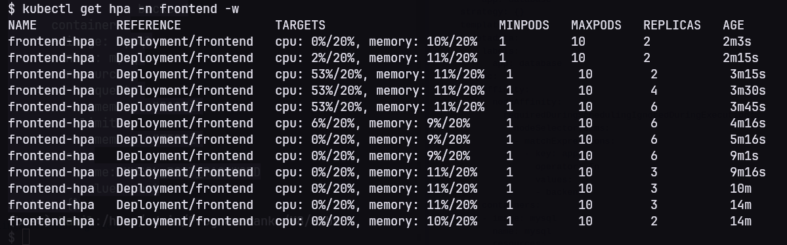
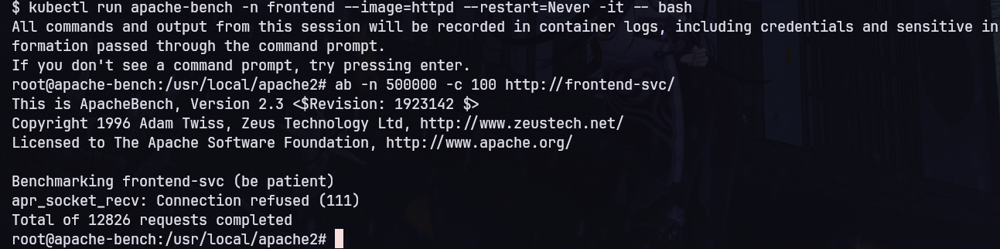

# Sprawozdanie

## Przygotowanie środowiska

Utworzenie nodów  
`minikube start --nodes 4 -p 4-nodes --cni=calico`

Dodanie labela dla node który będzie odpowiadał za backend    
`kubectl label nodes 4-nodes-m04 app=backend`

## Przygotowanie plików yaml

### Plik przestrzeni nazw

```yaml
apiVersion: v1
kind: Namespace
metadata:
  name: frontend
  labels:
    namespace: frontend
---

apiVersion: v1
kind: Namespace
metadata:
  name: backend
  labels:
    namespace: backend
```

### Pliki deploymentu

#### frontend-deploy.yaml  

```yaml
apiVersion: apps/v1
kind: Deployment
metadata:
  labels:
    app: frontend
  name: frontend
  namespace: frontend
spec:
  replicas: 3
  selector:
    matchLabels:
      app: frontend
  strategy: {}
  template:
    metadata:
      labels:
        app: frontend
    spec:
      affinity:
        nodeAffinity:
          requiredDuringSchedulingIgnoredDuringExecution:
            nodeSelectorTerms:
            - matchExpressions:
              - key: app
                operator: NotIn
                values:
                - backend
            - matchExpressions:
              - key: app
                operator: DoesNotExist
      containers:
      - image: nginx
        name: nginx
        resources: {}
status: {}
```

#### backend-deploy.yaml

```yaml
apiVersion: apps/v1
kind: Deployment
metadata:
  labels:
    app: backend
  name: backend
  namespace: backend
spec:
  replicas: 1
  selector:
    matchLabels:
      app: backend
  strategy: {}
  template:
    metadata:
      labels:
        app: backend
    spec:
      affinity:
        nodeAffinity:
          requiredDuringSchedulingIgnoredDuringExecution:
            nodeSelectorTerms:
            - matchExpressions:
              - key: app
                operator: In
                values:
                - backend 
      containers:
      - image: nginx
        name: nginx
        resources: {}
status: {}
```

#### database-deploy.yaml

Zdefiniowałem tutaj customowe wartości dla limit i requests zasobów ponieważ domyślne ustawiane przez  
limit range opisany później są zbyt małe i kontener z bazą nie uruchamia się

```yaml
apiVersion: apps/v1
kind: Deployment
metadata:
  labels:
    app: database
  name: database
  namespace: backend
spec:
  replicas: 1
  selector:
    matchLabels:
      app: database
  strategy: {}
  template:
    metadata:
      labels:
        app: database
    spec:
      affinity:
        nodeAffinity:
          requiredDuringSchedulingIgnoredDuringExecution:
            nodeSelectorTerms:
            - matchExpressions:
              - key: app
                operator: In
                values:
                - backend
      containers:
      - image: mysql
        name: mysql
        resources:
          requests:
            memory: "512Mi"
          limits:
            memory: "512Mi"
        env:
        - name: MYSQL_ROOT_PASSWORD
          value: root
status: {}
```

### Pliki serwisów

#### frontend-svc.yaml

```yaml
apiVersion: v1
kind: Service
metadata:
  name: frontend-svc
  namespace: frontend
spec:
  type: NodePort
  selector:
    app: frontend 
  ports:
    - protocol: TCP
      port: 80
      targetPort: 80
```

#### backend-svc.yaml

```yaml
apiVersion: v1
kind: Service
metadata:
  name: backend-svc
  namespace: backend
spec:
  type: ClusterIP
  selector:
    app: backend 
  ports:
    - protocol: TCP
      port: 80
      targetPort: 80
```

#### database-svc.yaml

```yaml
apiVersion: v1
kind: Service
metadata:
  name: database-svc
  namespace: backend
spec:
  type: ClusterIP
  selector:
    app: database 
  ports:
    - protocol: TCP
      port: 3306
      targetPort: 3306
```

### Pliki polityki sieciowej

#### netpol-frontend.yaml

Zezwoliłem tylko na ruch wyjściowy do przestrzeni nazw backend i do podów z label backend  
na porcie 80. Dodatkowo zezwoliłem na ruch wyjściowy na porcie 53 który służy do obsługi DNS.  
Bez tego komunikacja między podami będzie zablokowana ponieważ podczas próby połączenia  
FQDN nie będzie tłumaczona na adres IP.

```yaml
apiVersion: networking.k8s.io/v1
kind: NetworkPolicy
metadata:
  name: control-egress-frontend
  namespace: frontend
spec:
  podSelector:
    matchLabels:
      app: frontend
  policyTypes:
  - Egress
  egress:
  - to:
    - namespaceSelector:
        matchLabels:
          namespace: backend
      podSelector:
        matchLabels:
          app: backend
    ports:
    - protocol: TCP
      port: 80
  - ports:
    - protocol: UDP
      port: 53
    - protocol: TCP
      port: 53
```

#### netpol-database.yaml

```yaml
apiVersion: networking.k8s.io/v1
kind: NetworkPolicy
metadata:
  name: control-access-db
  namespace: backend
spec:
  podSelector:
    matchLabels:
      app: database
  policyTypes:
  - Ingress
  ingress:
  - from:
    - podSelector:
        matchLabels:
          app: backend
    ports:
    - protocol: TCP
      port: 3306
```

### Pliki quota i limit range

#### frontend-quota.yaml

Dodałem quota zgodnie z założeniami oraz limit range dla ustawienia wartości domyślnych  
wymaganych przez quota dla nowo tworzonych podów. Wybrałem takie wartości domyślne aby w sytuacji  
gdy hpa utworzy 10 podów to nie przekroczony został limit quoty.  

CPU: 10 * 100m = 1000m  
RAM: 10 * 140Mi = 1400Mi <= 1.5Gi

```yaml
apiVersion: v1
kind: ResourceQuota
metadata:
  name: frontend-quota
  namespace: frontend
spec:
  hard:
    pods: "10"
    requests.cpu: "1000m"
    limits.cpu: "1000m"
    requests.memory: "1.5Gi"
    limits.memory: "1.5Gi"
---

apiVersion: v1
kind: LimitRange
metadata:
  name: frontend-limits
  namespace: frontend
spec:
  limits:
  - default:
      cpu: "100m"
      memory: "140Mi"
    defaultRequest:
      cpu: "100m"
      memory: "140Mi"
    type: Container
```

#### backend-quota.yaml

Tutaj ta sama sytuacja. Quota zgodnie z założeniami i wartości domyślne tak aby nie przekroczyć  
quoty kiedy będzie 2 pody backend + pod bazy danych

CPU: 2 * 250m + 250m (baza danych) = 750m < 1000m  
RAM: 2 * 256Mi + 512Mi (custom request z pliku deploy bazy danych) = 1024Mi = 1Gi

```yaml
apiVersion: v1
kind: ResourceQuota
metadata:
  name: backend-quota
  namespace: backend
spec:
  hard:
    pods: "3"
    requests.cpu: "1000m"
    limits.cpu: "1000m"
    requests.memory: "1Gi"
    limits.memory: "1Gi"
---

apiVersion: v1
kind: LimitRange
metadata:
  name: backend-limits
  namespace: backend
spec:
  limits:
  - default:
      cpu: "250m"
      memory: "256Mi"
    defaultRequest:
      cpu: "250m"
      memory: "256Mi"
    type: Container
```
### Plik hpa dla frontend

AverageUtilization ustawiłem na 20% tak aby było widać, że skaler działa w trakcie testów

```yaml
apiVersion: autoscaling/v2
kind: HorizontalPodAutoscaler
metadata:
  name: frontend-hpa
  namespace: frontend
spec:
  scaleTargetRef:
    apiVersion: apps/v1
    kind: Deployment
    name: frontend
  minReplicas: 1 
  maxReplicas: 10
  metrics:
  - type: Resource
    resource:
      name: cpu
      target:
        type: Utilization
        averageUtilization: 20
  - type: Resource
    resource:
      name: memory
      target:
        type: Utilization
        averageUtilization: 20
```

## Test hpa

W jednym terminalu uruchomiłem poda z apache-bend w przestrzeni nazw frontend  
`kubectl run apache-bench -n frontend --image=httpd --restart=Never -it -- bash`  
i wydałe polecenie `ab -n 500000 -c 100 http://frontend-svc/` które wysyła na serwis  
frontend-svc 500000 zapytań ze 100 jednoczesnych połączeń  

W drugim terminalu sprawdziłem komendą `kubectl get hpa -n frontend -w` jak będzie  
zachowywał się autoskaler. Jak widać na załączonym obrazku skaler działa poprawnie
  


