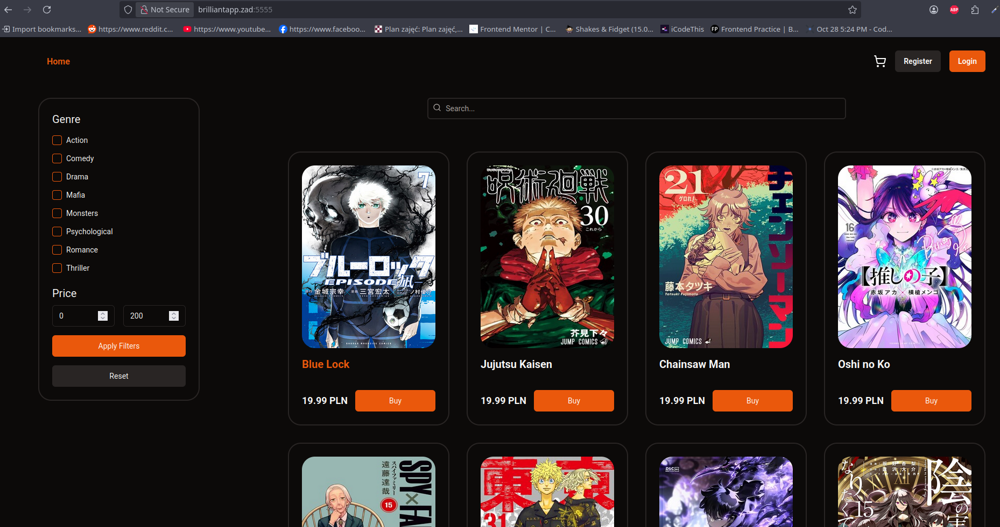
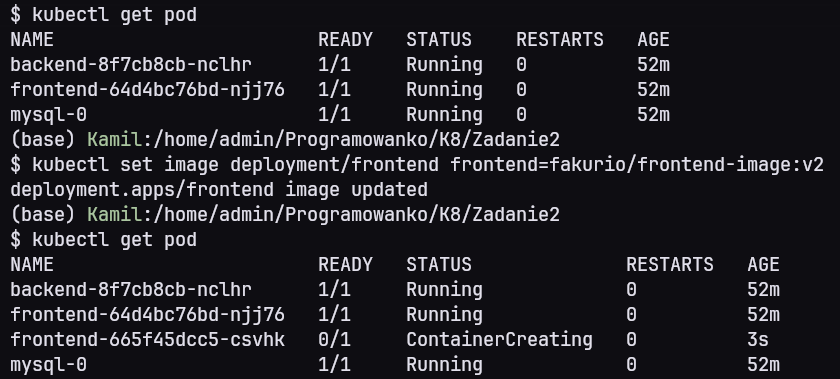
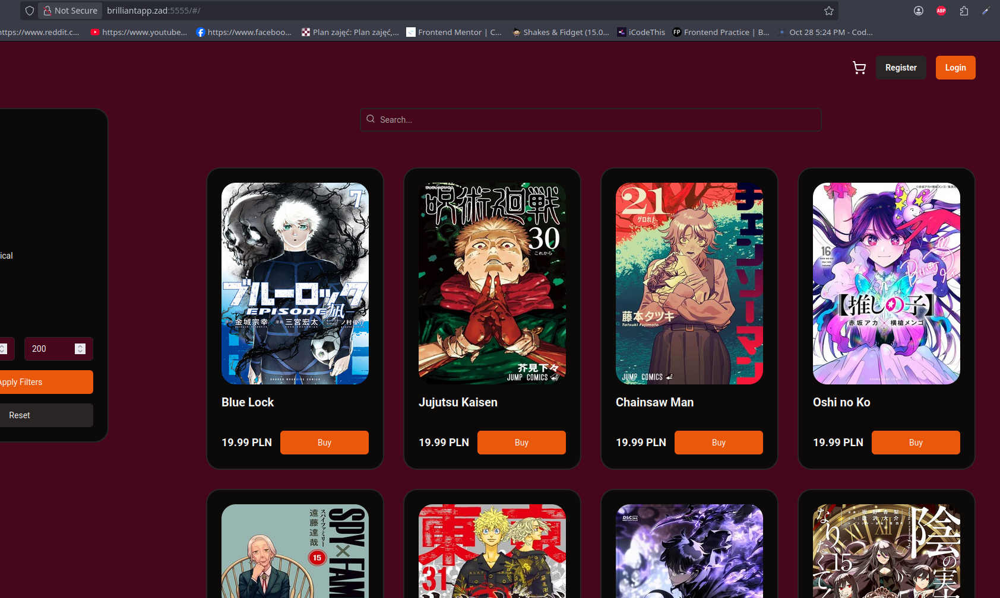
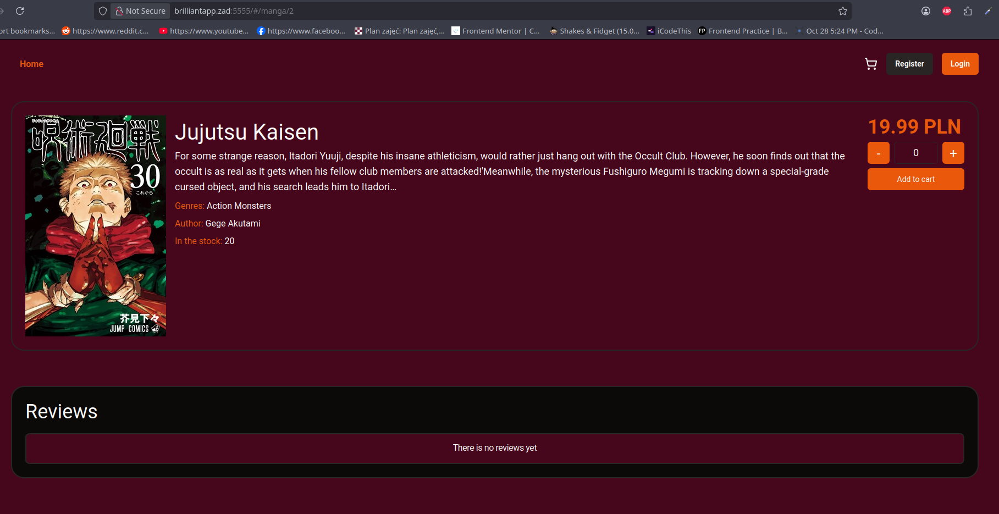

# Sprawozdanie

Jako aplikacje do wdrożenia wybrałem jeden z moich poprzednich projektów.  
Jest to prototyp sklepu internetowego z mangami, opis znajduje się w poniższym repo  
https://github.com/Fakurio/MangaShop  

## Opis środowiska

Aplikacja zostanie uruchomiona na 4 węzłowym klastrze wykorzystywanym w poprzednich laboratoriach.  
Backend wraz baza danych oraz frontend będzię uruchomiony na odzielnych węzłach wykorzystując node affinity.  
Frontend i backend będzie wdrożony poprzez deployment natomiast baza danych będzię wykorzystywać  
stateful set wraz z headless serwisem.  
Całość architektury będzie ukryta za ingressem który będzie podejmował decyzję czy przesłać żądanie do  
serwisu aplikacji frontend czy backend.

## Pliki konfiguracyjne

### dockerfile na aplikacji Svelte
Frontend wykorzystuje serwer nginx do serwowania zbudowanej aplikacji. Jako adres serwera podawana  
jest relatywna ścieżka "/api" która będzie używana w konfiguracji ingressu do rozróżnienia do którego  
serwisu przesłać request

```yaml
FROM node:20.12.2 as base
WORKDIR /app
COPY package*.json ./
RUN npm ci
COPY . .

ENV VITE_SERVER_HOST="/api"
RUN npm run build

FROM nginx:1.21.1
WORKDIR /usr/share/nginx/html
RUN rm -rf ./*
COPY --from=base /app/dist .

COPY nginx.conf /etc/nginx/conf.d/default.conf

RUN chmod -R 755 /usr/share/nginx/html
EXPOSE 80
CMD ["nginx", "-g", "daemon off;"]
```

### nginx.conf
```
server {
    listen 80;
    server_name localhost;

    root /usr/share/nginx/html;
    index index.html;

    include /etc/nginx/mime.types;
    default_type application/octet-stream;

    location /assets/ {
        try_files $uri =404;
    }

    # Fallback: Redirect everything else to index.html
    location / {
        try_files $uri $uri/ /index.html;
    }
}
```

### frontend.yaml

```yaml
apiVersion: apps/v1
kind: Deployment
metadata:
  name: frontend
spec:
  replicas: 1
  selector:
    matchLabels:
      app: frontend
  template:
    metadata:
      labels:
        app: frontend
    spec:
      affinity:
        nodeAffinity:
          requiredDuringSchedulingIgnoredDuringExecution:
            nodeSelectorTerms:
            - matchExpressions:
              - key: app
                operator: In
                values:
                - frontend
      containers:
      - name: frontend
        image: fakurio/frontend-image:latest
        imagePullPolicy: Always
        ports:
        - containerPort: 80
---
apiVersion: v1
kind: Service
metadata:
  name: frontend
spec:
  selector:
    app: frontend
  ports:
    - protocol: TCP
      port: 80
      targetPort: 80
```

### dockerfile dla aplikacji NestJS
Backend jest uruchamiany bezpośrednio w kontenerze, a nie w przeglądarce użytkownika jak aplikacja  
kliencka dlatego zmienne środowiskowe nie muszą być "baked" w obrazie i są dostępne runtime.  
Dodatkowo przed uruchomieniem serwera odpalane są migracje aby zapełnić bazę startowymi danymi.

```yaml
FROM node:20.12.2 as base
WORKDIR /app
COPY package*.json ./
RUN npm ci
COPY . .
RUN npm run build

FROM node:20-slim
WORKDIR /app
COPY --from=base /app/package*.json ./
RUN npm install --omit=dev
COPY --from=base /app/dist ./dist
EXPOSE 3000
ENTRYPOINT ["/bin/bash", "-c"]
CMD ["npm run typeorm migration:run && npm run start:prod"]
```

### backend.yaml

Wszystkie zmienne środowiskowe są ładowe za pomocą config/secret map w zależności czy są to dane wrażliwe.  
Ich konfiguracja będzię w pliku kustomization.yaml
```yaml
apiVersion: apps/v1
kind: Deployment
metadata:
  name: backend
spec:
  replicas: 1
  selector:
    matchLabels:
      app: backend
  template:
    metadata:
      labels:
        app: backend
    spec:
      affinity:
        nodeAffinity:
          requiredDuringSchedulingIgnoredDuringExecution:
            nodeSelectorTerms:
            - matchExpressions:
              - key: app
                operator: In
                values:
                - backend
      containers:
      - name: backend
        image: fakurio/backend-image:latest
        imagePullPolicy: Always
        ports:
        - containerPort: 3000
        env:
        - name: DB_HOST
          valueFrom:
            configMapKeyRef:
              name: app-config
              key: DB_HOST
        - name: DB_PORT
          valueFrom:
            configMapKeyRef:
              name: app-config
              key: DB_PORT
        - name: DB_NAME
          valueFrom:
            configMapKeyRef:
              name: app-config 
              key: MYSQL_DATABASE
        - name: DB_USERNAME
          valueFrom:
            configMapKeyRef:
              name: app-config
              key: DB_USERNAME
        - name: DB_PASSWORD
          valueFrom:
            secretKeyRef:
              name: app-secrets
              key: MYSQL_ROOT_PASSWORD
        - name: NODE_ENV
          valueFrom:
            configMapKeyRef:
              name: app-config
              key: NODE_ENV
        - name: JWT_SECRET
          valueFrom:
            secretKeyRef:
              name: app-secrets
              key: JWT_SECRET
        - name: JWT_EXPIRES_IN
          valueFrom:
            configMapKeyRef:
              name: app-config
              key: JWT_EXPIRES_IN
        - name: JWT_REFRESH_EXPIRES_IN
          valueFrom:
            configMapKeyRef:
              name: app-config
              key: JWT_REFRESH_EXPIRES_IN
        - name: COOKIE_MAX_AGE
          valueFrom:
            configMapKeyRef:
              name: app-config
              key: COOKIE_MAX_AGE
        - name: CORS_WHITELIST_ORIGINS
          valueFrom:
            configMapKeyRef:
              name: app-config
              key: CORS_WHITELIST_ORIGINS 
---
apiVersion: v1
kind: Service
metadata:
  name: backend
spec:
  selector:
    app: backend
  ports:
    - protocol: TCP
      port: 3000
      targetPort: 3000
```

### kustomization.yaml
```yaml
apiVersion: kustomize.config.k8s.io/v1beta1
kind: Kustomization

resources:
  - mysql.yaml
  - backend.yaml
  - frontend.yaml
  - ingress.yaml

configMapGenerator:
  - name: app-config
    literals:
      - MYSQL_DATABASE=mangashop
      - DB_HOST=mysql
      - DB_PORT=3306
      - DB_USERNAME=root
      - NODE_ENV=prod
      - JWT_EXPIRES_IN=5m
      - JWT_REFRESH_EXPIRES_IN=1d
      - COOKIE_MAX_AGE=86400000
      - CORS_WHITELIST_ORIGINS=[]

secretGenerator:
  - name: app-secrets
    literals:
      - JWT_SECRET=strong_secret
      - MYSQL_ROOT_PASSWORD=root
```

### ingress.yaml

Przedrostek /api używany jest do rożnienia do którego serwisu przesłać żądanie. Dla wszystkich requestów   
zawierących /api fragment ten jest ucinany i przekazywany do serwisu backendu.
```yaml
apiVersion: networking.k8s.io/v1
kind: Ingress
metadata:
  name: app-ingress
  annotations:
    nginx.ingress.kubernetes.io/use-regex: "true"
    nginx.ingress.kubernetes.io/rewrite-target: /$2
spec:
  rules:
  - host: brilliantapp.zad
    http:
      paths:
      # BACKEND: /api/users -> /users
      - path: /api(/|$)(.*)
        pathType: ImplementationSpecific
        backend:
          service:
            name: backend
            port:
              number: 3000
              
      # FRONTEND: Dodajemy sztuczną grupe "()" dla zasady /$2 
      - path: /()(.*)
        pathType: ImplementationSpecific
        backend:
          service:
            name: frontend
            port:
              number: 80
```

## Uruchomienie aplikacji

Obrazy aplikacji Svelte i NestJS zbudowałem wcześniej i wysłałem na docker hub.  

Całość systemu wdrożyłem komendą  
`kubectl apply -k k8s/.`  

  

Aby uzyskać dostęp do aplikacji z przeglądarki trzeba dodać nowy wpis DNS do /etc/hosts  
```
127.0.0.1 brilliantapp.zad
```
a następnie przekierować kontroler ingressu na lokalny port komputera komendą  
```
kubectl port-forward -n ingress-nginx service/ingress-nginx-controller 5555:80
```

Aplikacja jest dostępna w przeglądarce na adresie ```http://brilliantapp.zad:5555```  



## Część nieobowiązkowa

Jako aktualizację aplikacji wybrałem zmiane koloru tła na wszystkich podstronach.  
Nowy obraz z aplikacją frontu ztagowałem jako v2 i wysłałem na docker hub.  
Następnie podmieniłem obraz dla deploymentu frontentu komendą  

```kubectl set image deployment/frontend frontend=fakurio/frontend-image:v2```  

Przez to, że obraz posiada nowy tag deploy automatycznie zaczyna aktualizację podów  

 

Po odświerzeniu przeglądarki zmiany są widoczne



 
